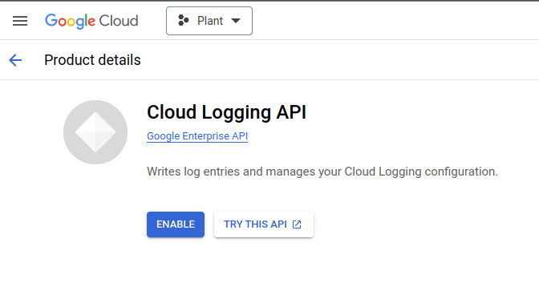
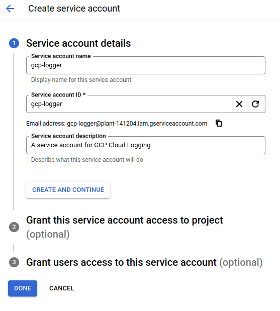
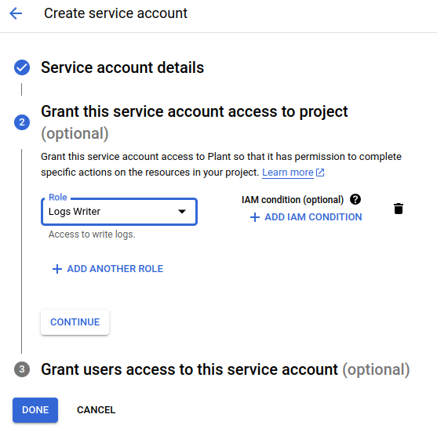
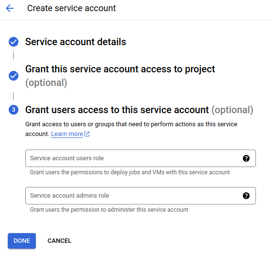
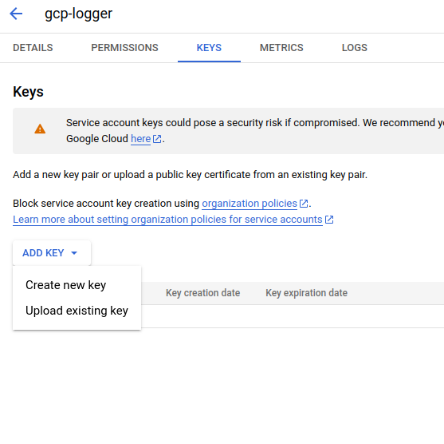
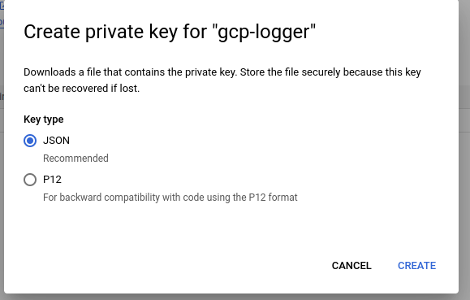

# GCP Cloud Logging Notes

GCP is Google Cloud Platform.

Here are the steps that you'll need to take to be able to use the Cloud Logging feature/API.

## Enable the API

On GCP, APIs need to be enabled for your project first.

You can [enable cloud logging at this link](https://console.cloud.google.com/apis/library/logging.googleapis.com). You will need to create/select a project first. In this example I've selected a project that I named `Plant`.

## Setup a Service Account

From the main menu select `IAM & Admin` and then `Service Accounts` under that.

Click `+ CREATE SERVICE ACCOUNT`.

Fill in a name. I just called it `gcp-logger`.

Click on the `Role` drop down and either filter or find `Logs Writer`. This allows this service account to, as the name suggests, write logs.

`Grant users access...` can be left empty and this step completed.

Find the `KEYS` section and click the `ADD KEY` drop down and `Create new key`.

Make sure that it's a `JSON` key type and save that locally. From that file you'll need to provide the `project_id`, `private_key` and `client_email` to get GCP Cloud Logging to work.

